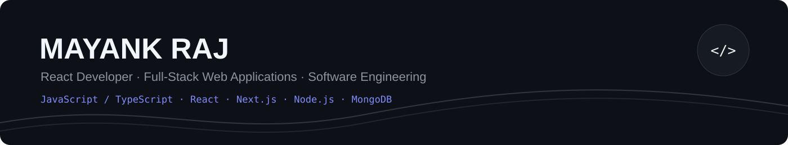
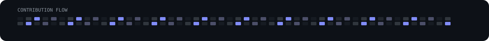

<!--
  Mayank Raj · GitHub Profile README
  Visual profile inspired by a modern developer portfolio layout.
-->

 

&nbsp;
&nbsp;

  

<table>
  <tr>
    <td align="center" width="220"><b>30+</b> DSA problems solved on LeetCode</td>
    <td align="center" width="220"><b>4</b> featured projects built & shipped</td>
    <td align="center" width="220"><b>3+</b> core web stacks used in projects</td>
    <td align="center" width="220"><b>Multiple</b> college project expo wins</td>
  </tr>
</table>

## Builds

<table>
  <tr>
    <td width="50%" valign="top">
      <h3 align="center"><a href="https://github.com/May-nk/devlens">🧠 DevLens</a></h3>
      
AI-Powered Developer Assessment Platform

      
Analyzes GitHub repositories, commit history, languages, and project structure to generate a 0–100 Developer Readiness Score across six engineering dimensions.

      
<code>Next.js</code> <code>TypeScript</code> <code>MongoDB</code> <code>GitHub API</code> <code>OpenRouter</code> <code>Zod</code> <code>Vitest</code>

      &nbsp;
      
    </td>
    <td width="50%" valign="top">
      <h3 align="center">🖥️ Online Cheat Detection System</h3>
      
AI-assisted online examination proctoring

      
Real-time examination monitoring with face and eye-gaze tracking, suspicious head-movement detection, tab-switch detection, full-screen enforcement, and automatic submission.

      
<code>Python</code> <code>Flask</code> <code>OpenCV</code> <code>MediaPipe</code> <code>Socket.IO</code>

      
    </td>
  </tr>

  <tr>
    <td width="50%" valign="top">
      <h3 align="center"><a href="https://github.com/May-nk/taskflow-scheduler">⚙️ TaskFlow Scheduler</a></h3>
      
Task dependency scheduler · DAA project

      
Interactive task scheduling application built around dependency ordering and topological sorting, with a React-based interface for managing task relationships.

      
<code>TypeScript</code> <code>React</code> <code>Vite</code>

      &nbsp;
      
    </td>
    <td width="50%" valign="top">
      <h3 align="center"><a href="https://github.com/May-nk/chicago-crime-dashboard">📊 Chicago Crime Dashboard</a></h3>
      
Data analysis & visualization project

      
Data-processing and exploratory-analysis dashboard built around the Chicago crime dataset, including cleaning, filtering, analysis, and visual exploration.

      
<code>Python</code> <code>Streamlit</code> <code>NumPy</code> <code>Matplotlib</code>

      
    </td>
  </tr>
</table>

## Wins

 

  

## Stack

<table>
  <tr>
    <td align="right"><b>Languages</b></td>
    <td></td>
  </tr>
  <tr>
    <td align="right"><b>Frontend</b></td>
    <td></td>
  </tr>
  <tr>
    <td align="right"><b>Backend & APIs</b></td>
    <td></td>
  </tr>
  <tr>
    <td align="right"><b>Database</b></td>
    <td></td>
  </tr>
  <tr>
    <td align="right"><b>Tools</b></td>
    <td></td>
  </tr>
</table>

**Concepts** &nbsp;·&nbsp; `DSA` `OOP` `DBMS` `Authentication` `REST APIs` `API Integration` `Software Engineering`

## Momentum

## Analytics

  

  

<b>May-nk</b> · building, learning, and shipping one project at a time.

  

